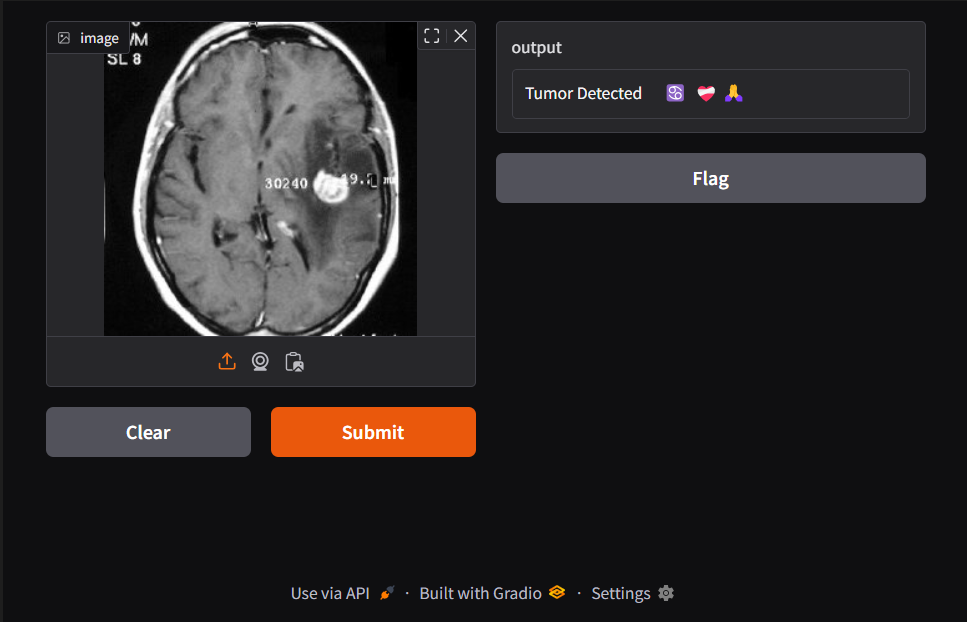
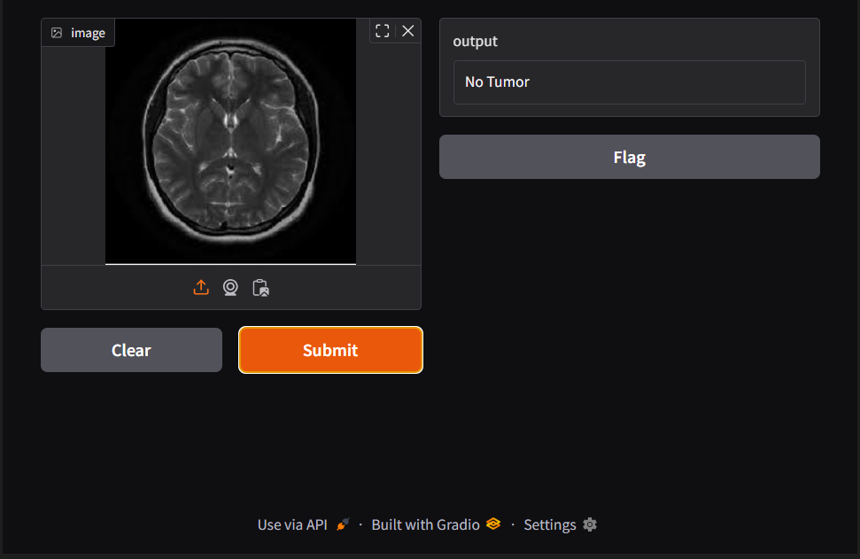

# Brain Tumor Detection using CNN

This project uses a Convolutional Neural Network (CNN) to detect brain tumors from MRI images. The model is trained on a dataset containing images of brains with and without tumors.

## Features
- **Image Classification**: Classifies MRI images as either "Tumor" or "No Tumor".
- **Gradio Interface**: Provides an interactive interface for users to upload images and get predictions.
- **Visualization**: Displays sample images and predictions.

---

## Sample Images

### Brain with Tumor


### Brain without Tumor


---

## Gradio Interface Outputs

### Example Output - With Tumor


### Example Output - Without Tumor


---

## Requirements

To run this project, install the following dependencies:

```bash
pip install tensorflow numpy matplotlib pillow gradio
```

---

## Usage

1. Clone the repository and navigate to the project directory.
2. Ensure the dataset is placed in the `brain_tumor_dataset` folder with subfolders `yes` and `no`.
3. Run the Jupyter Notebook or Python script to train the model and launch the Gradio interface.

```bash
python brain_tumor_detection.ipynb
```

4. Use the Gradio interface to upload an image and get predictions.

---

## Dataset Structure

The dataset should be organized as follows:

```
brain_tumor_dataset/
├── yes/
│   ├── Y1.jpeg
│   ├── Y2.jpeg
│   └── ...
├── no/
│   ├── 1 no.jpeg
│   ├── 2 no.jpeg
│   └── ...
```

---

## Results

The trained model achieves high accuracy in detecting brain tumors. Below is an example of the Gradio interface output:

- **Input Image**: MRI scan of a brain.
- **Prediction**: "Tumor Detected" or "No Tumor".

---

## License

This project is licensed under the MIT License. Feel free to use and modify it as needed.