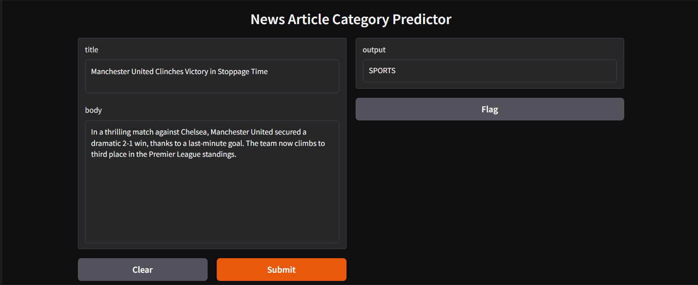

# News Article Category Predictor

This project aims to classify news articles into predefined categories using machine learning techniques. The dataset consists of news articles with their titles, bodies, and categories.

## Predicted Image

Below is an example of a predicted image generated by the model:



## Project Structure

- `NewsArticleCategoryPredictor.ipynb`: Jupyter notebook containing the code for data preprocessing, model training, and evaluation.
- `news-article-categories.csv`: Dataset containing news articles with their titles, bodies, and categories.
- `gradio_interface.py`: Python script to launch the Gradio interface for the model.

## Setup Instructions

1. Clone the repository:
    ```bash
    git clone <repository-url>
    cd News-article-category-predictor
    ```

2. Install the required dependencies:
    ```bash
    pip install -r requirements.txt
    ```

3. Download the dataset and place it in the project directory.

## Usage

1. Open the Jupyter notebook:
    ```bash
    jupyter notebook NewsArticleCategoryPredictor.ipynb
    ```

2. Follow the steps in the notebook to preprocess the data, train the model, and evaluate its performance.

## Natural Language Processing (NLP)

Natural Language Processing (NLP) is a field of artificial intelligence that focuses on the interaction between computers and humans through natural language. It involves the application of computational techniques to analyze and synthesize natural language and speech.

## NLTK

The Natural Language Toolkit (NLTK) is a leading platform for building Python programs to work with human language data. It provides easy-to-use interfaces to over 50 corpora and lexical resources, along with a suite of text processing libraries for classification, tokenization, stemming, tagging, parsing, and more.

## Gradio

Gradio is a Python library that allows you to quickly create user interfaces for machine learning models. It provides a simple way to create web-based interfaces that can be used to interact with your models, making it easier to test and share them with others.

## Scikit-learn

Scikit-learn is a popular machine learning library in Python. It provides simple and efficient tools for data mining and data analysis, and it is built on NumPy, SciPy, and matplotlib. Scikit-learn is widely used for implementing machine learning algorithms and performing tasks such as classification, regression, clustering, and more.

## Model Comparison

The notebook compares two feature extraction techniques:
- **TF-IDF**: Suitable for long texts like articles and blogs.
- **CountVectorizer**: Suitable for short texts like tweets and headlines.

## Results

- **CountVectorizer**: Best Accuracy: 78.76% (test_size=0.2, random_state=1)
- **TF-IDF**: Best Accuracy: 76.58% (test_size=0.2, random_state=42)

## Conclusion

CountVectorizer performed better than TF-IDF on this dataset. Depending on the text length and application, choose the appropriate feature extraction technique.

## Which One Should You Use?

| Scenario | Better Choice |
| --- | --- |
| Short texts (e.g., tweets, headlines) | CountVectorizer |
| Long texts (e.g., articles, blogs) | TF-IDF |
| Spam detection, sentiment analysis | TF-IDF (removes noise) |
| Naïve Bayes model | CountVectorizer (because NB assumes independent word probabilities) |

Since you're working with news articles, TF-IDF might be better, but CountVectorizer can also perform well. If titles are short, CountVectorizer may be better. If you're using the full article body, TF-IDF could help more.

## Sample Input and Output

#### Example 1: Technology
**Title:** Apple Unveils Latest iPhone with Advanced AI Features  
**Body:** Apple has announced its newest iPhone, featuring an improved camera, a faster processor, and a new AI-powered assistant. The device is set to launch next month and is expected to revolutionize smartphone technology.  
**Predicted Category:** Technology

#### Example 2: Sports
**Title:** Manchester United Clinches Victory in Stoppage Time  
**Body:** In a thrilling match against Chelsea, Manchester United secured a dramatic 2-1 win, thanks to a last-minute goal. The team now climbs to third place in the Premier League standings.  
**Predicted Category:** Sports

#### Example 3: Politics
**Title:** Government Introduces New Climate Policy to Cut Emissions  
**Body:** The government has unveiled a new policy aimed at reducing carbon emissions, requiring industries to meet strict environmental standards by 2030. Experts believe this could be a major step in tackling climate change.  
**Predicted Category:** Politics

#### Example 4: Business
**Title:** Tesla Stock Surges After Record-Breaking Profits  
**Body:** Tesla's stock price jumped 10% following the release of its latest earnings report, which revealed record-breaking profits. The growth was driven by strong electric vehicle sales and expansion into international markets.  
**Predicted Category:** Business

#### Example 5: Entertainment
**Title:** New Marvel Movie Smashes Box Office Records  
**Body:** The latest Marvel superhero film has broken all previous records, grossing over $500 million in its opening weekend. Fans and critics alike are praising the movie’s action-packed storyline and stunning visuals.  
**Predicted Category:** Entertainment

#### Example 6: Health
**Title:** Scientists Develop Promising Vaccine for Rare Disease  
**Body:** A team of researchers has developed a new vaccine that shows promising results in preventing a rare but deadly disease. Clinical trials are set to begin next year, raising hopes for a breakthrough in medical science.  
**Predicted Category:** Health

#### Example 7: Science
**Title:** NASA’s Mars Rover Finds Evidence of Ancient Water  
**Body:** NASA’s latest Mars rover has successfully collected rock samples, revealing evidence of ancient water on the planet. Scientists believe this discovery could offer new insights into the possibility of past life on Mars.  
**Predicted Category:** Science